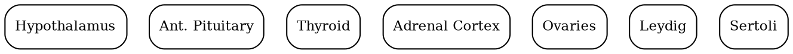
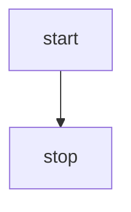

```
dot
digraph Endocrine {
  rankdir=TD;
  node [shape=box, style=rounded, fontsize=11];

  H  [label="Hypothalamus"];
  AP [label="Ant. Pituitary"];
  T  [label="Thyroid"];
  A  [label="Adrenal Cortex"];
  O  [label="Ovaries"];
  L  [label="Leydig"];
  S  [label="Sertoli"];

  subgraph cluster_HPT {
    label="HPT Axis";
    H -> AP [label="TRH"];
    AP -> T [label="TSH"];
    T -> T4 [label="T4"];
    T -> T3 [label="T3"];
    T4 -> T3 [label="conv."];
    T3 -> H  [label="–", style=dashed, arrowhead=tee];
    T3 -> AP [label="–", style=dashed, arrowhead=tee];
  }

  subgraph cluster_HPA {
    label="HPA Axis";
    H -> AP [label="CRH"];
    AP -> A [label="ACTH"];
    A  -> CORT [label="Cortisol"];
    CORT -> H  [label="–", style=dashed, arrowhead=tee];
    CORT -> AP [label="–", style=dashed, arrowhead=tee];
  }

  subgraph cluster_HPG {
    label="HPG Axis";
    H -> AP  [label="GnRH"];
    AP -> O  [label="FSH/LH"];
    AP -> L  [label="LH"];
    O  -> E  [label="Estrogen"];
    L  -> TST[label="Testosterone"];
    E  -> H  [label="–", style=dashed, arrowhead=tee];
    TST-> H  [label="–", style=dashed, arrowhead=tee];
  }
}
```





