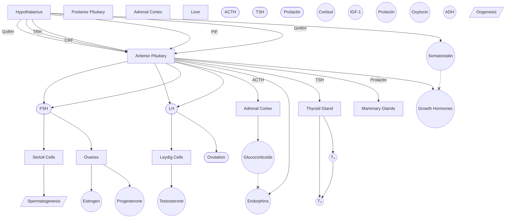
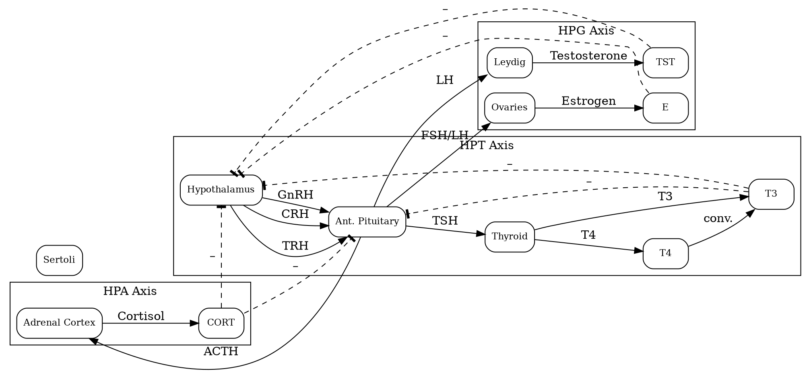

#InProgress 
- How organs and tissues communicate with each other
- Allows organisms to respond to changes in internal and external stimuli to maintain homeostasis
- Relies on hormonal communication
- Influenced by and influences the [[Nervous System|nervous system]]

## [[Pituitary Gland]]

The pituitary gland has two lobes: the ***anterior** pituitary* and the ***posterior** pituitary*. How the hypothalamus sends the signal depends on which lobe the axis utilizes. 

### [[Anterior Pituitary]]
The [[Anterior Pituitary|anterior pituitary]] (AP) is made of glandular tissue that can both synthesize and secrete [[Peptide Hormones|peptide hormones]]. The hypothalamus releases ***releasing*** and ***inhibiting*** factors into the ***hypophyseal [[portal system]]***.  
- Hypothalamus sends ==endocrine hormones to anterior pituitary==

#### Axes Involving Anterior Pituitary

- [[Reproductive Axis]]
	- AP hormones: **FSH (Follicle Stimulating Hormone)** and **LH (Lutenizing Hormone)**
- [[HPA Axis]]
- [[Thyroid Axis]]

| Hypothalamic Hormone | AP Hormone | Target Tissue          | Effect          |
| -------------------- | ---------- | ---------------------- | --------------- |
| GnRH                 | FSH        | Ovaries, Sertoli cells |                 |
|                      | LH         |                        |                 |
| CRF                  | ACTH       | Adrenal cortex         | glucocorticoids |
| TRH                  | TSH        |                        |                 |

### [[Posterior Pituitary]]
The [[Posterior Pituitary]] only *stores* hormones that the *hypothalamus produces*. The hypothalamus sends axons down into the posterior pituitary. When depolarized, the posterior pituitary releases the hormones (known as **neurohormones**) from the [[Neuron Structure|axon terminals]]. 

## Adrenal Cortex
- medulla: catecholamines
- 

whether the axis uses the [[Anterior Pituitary|anterior pituitary]] or the [[Posterior Pituitary|posterior pituitary]].

