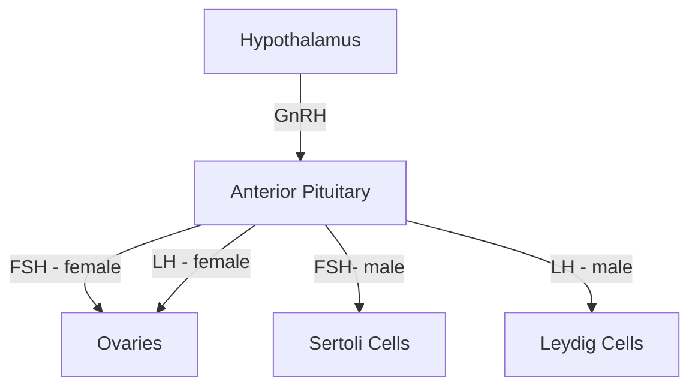

1. GnRH expressing neurons in the [[hypothalamus]] releases [[Gonadotropin Releasing Hormone (GnRH)]]. 
2. The [[anterior pituitary]], in response, releases [[Follicle Stimulating Hormone]] and [[Lutenizing Hormone]]

## Reproductive 

