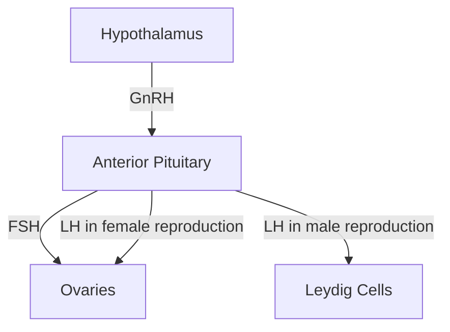

```mermaid
graph TD
H[Hypothalamus]
AP[Anterior Pituitary]
O[Ovaries]
L[Leydig Cells]

H--> |GnRH| AP
AP -->|FSH| O
AP --> |LH in female reproduction| O
AP --> |LH in male reproduction| L
```

1. GnRH expressing neurons in the 