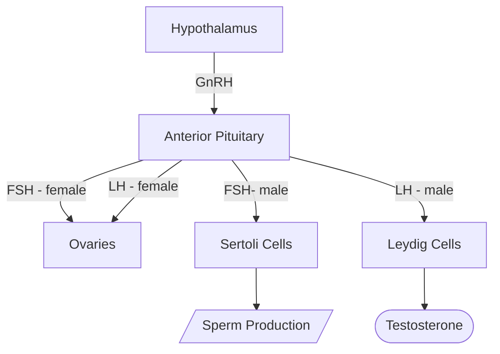

#InProgress 


1. GnRH expressing neurons in the [[hypothalamus]] releases [[Gonadotropin Releasing Hormone (GnRH)]]. 
2. The [[anterior pituitary]], in response, releases [[Follicle Stimulating Hormone]] and [[Lutenizing Hormone]]

- Talk about anti mullerian hormone and mullerian ducts
- mesonephric ducts

## Reproductive Axis in Females

The ovarian and uterine cycles in females occur concurrently. We'll first talk about each separately and then put it together. 

### Ovarian Cycle
1. **Follicular Phase**: Hypothalamus releases **GnRH**, so AP releases *small* amounts of **FSH** and **LH**
	- FSH and LH act on the **ovaries** and causes it to release **estrogens**. 
		- Low levels of estrogen ***inhibits*** GnRH production, but high levels ***stimulates*** it
	- Rising estrogen levels cause a *surge* of LH (and FSH to a smaller extent)

GRAPH HERE OF JUST FOLLICULAR PHASE

2. **Ovulation**: The LH surge causes the ovarian follicle to rupture and *release* a [[Oogenesis|secondary oocyte]] into the uterine tube
3. **Luteal Phase**: LH makes the now ruptured follicle become the **corpus luteum**
	- Corpus luteum secretes lots of **progesterone** (and some estrogen)
	- The high levels of progesterone *suppress GnRH production*
	- 

```chart
type: line
labels: [0,5,10,14,20,28]
series:
  - title: FSH
    color: deeppink
    data: [1,1.5,1.8,2.2,1.4,1]
  - title: LH
    color: dodgerblue
    data: [1,1.3,2.2,4.5,1.5,1]
  - title: Estrogen
    color: purple
    data: [1,2,3,2.5,4,1]
  - title: Progesterone
    color: seagreen
    data: [0.5,0.5,1,2,4.5,3]
options:
  scales:
    x:
      title:
        display: true
        text: "Day of cycle"
    y:
      title:
        display: false
        
	elements:
		line: 
			tension: 0.5
```
