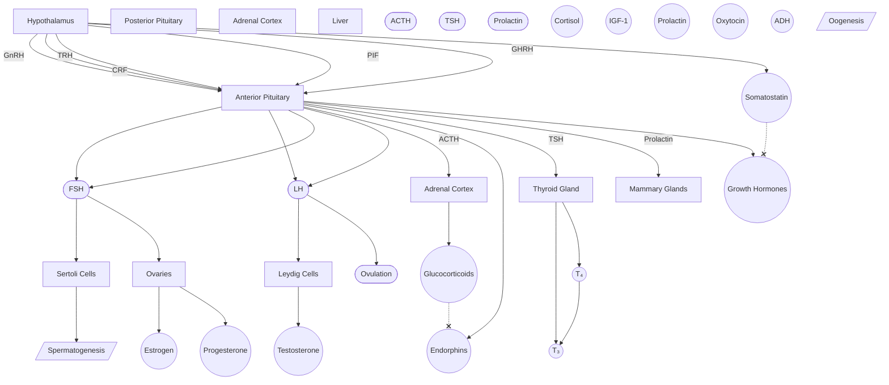
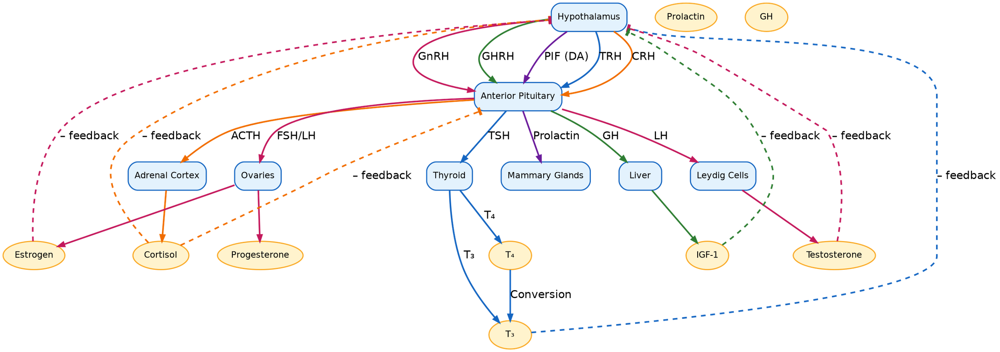

 #InProgress 

- How organs and tissues communicate with each other
- Allows organisms to respond to changes in internal and external stimuli to maintain homeostasis
- Relies on hormonal communication
- Influenced by and influences the [[Nervous System|nervous system]]

## [[Public/Endocrine System/Pituitary Gland|Pituitary Gland]]

The pituitary gland has two lobes: the ***anterior** pituitary* and the ***posterior** pituitary*. How the hypothalamus sends the signal depends on which lobe the axis utilizes. 

### [[Public/Endocrine System/Anterior Pituitary|Anterior Pituitary]]
The [[Public/Endocrine System/Anterior Pituitary|anterior pituitary]] (AP) is made of glandular tissue that can both synthesize and secrete [[Public/Endocrine System/Peptide Hormones|peptide hormones]]. The hypothalamus releases ***releasing*** and ***inhibiting*** factors into the ***hypophyseal [[portal system]]***.  
- Hypothalamus sends ==endocrine hormones to anterior pituitary==

#### Axes Involving Anterior Pituitary

##### Tropic Hormones

- [[Public/Endocrine System/Reproductive Axis|HPG Axis]]
	- AP hormones: **FSH (Follicle Stimulating Hormone)** and **LH (Lutenizing Hormone)**
	- GnRH --> FSH + LH --> Androgens
- [[Public/Endocrine System/HPA Axis|HPA Axis]]
	- CRH --> ACTH --> glucocorticoids
- [[Public/Endocrine System/Thyroid Axis|HPT Axis]]
	- TRH --> TSH --> T3 + T4

##### Direct Hormones
- [[Prolactin]]
	- PIF (Dopamine) --| Prolactin
- [[Endorphins]]
	- CRH --> Endorphins
	- Glucocorticoids --| Endorphins
- [[Growth Hormone]]
	- GHRH --> GH
	- Somatostatin --| GH

| Hypothalamic Hormone | AP Hormone | Target Tissue          | Effect          |
| -------------------- | ---------- | ---------------------- | --------------- |
| GnRH                 | FSH        | Ovaries, Sertoli cells |                 |
|                      | LH         |                        |                 |
| CRF                  | ACTH       | Adrenal cortex         | glucocorticoids |
| TRH                  | TSH        |                        |                 |

### [[Public/Endocrine System/Posterior Pituitary]]
The [[Public/Endocrine System/Posterior Pituitary]] only *stores* hormones that the *hypothalamus produces*. The hypothalamus sends axons down into the posterior pituitary. When depolarized, the posterior pituitary releases the hormones (known as **neurohormones**) from the [[Neuron Structure|axon terminals]]. 

[[ADH]]
[[Oxytocin]]

## Target Tissues

### [[Adrenal Gland]]
### [[Renal Hormones]]

### [[pancreatic hormones]]

[[Public/Endocrine System/Renin-Angiotenisin-Aldosterone System]]
[[Catecholamines]]

[[Parathyroid Gland]]

Appetite hormones
[[ghrelin]]
[[leptin]]
[[somatostatin]]

[[pineal gland]]
[[thymus]]

[[anp]]

[[Digestion]]
[[Gastrin]]
[[Cholecystekinin]]

whether the axis uses the [[Public/Endocrine System/Anterior Pituitary|anterior pituitary]] or the [[Public/Endocrine System/Posterior Pituitary|posterior pituitary]].

